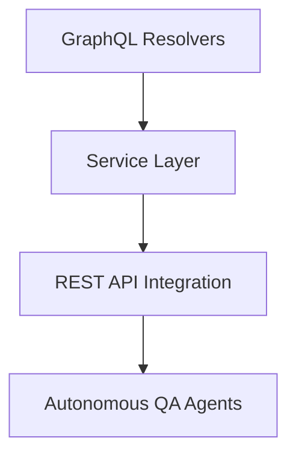

# SpaceX GraphQL API


[](https://railway.app/new/template/WdJd2w?referralCode=xsbY2R)

This graph is a recreation of the [SpaceXLand/api](https://github.com/SpaceXLand/api) project that was authored by [Carlos Rufo](https://github.com/itscarlosrufo). The code for this recreation is open source and can be viewed [here](https://github.com/apollographql/spacex).

The original project used a MongoDB that was deprecated in favor of Launch Library 2; you can read about the issue [here](https://github.com/r-spacex/SpaceX-API/issues/1243). The team plans to keep the REST API in place but unmaintained. This project utilized the REST API to implement the same schema, but there are some gaps that have been marked `@deprecated`. For example, `Missions` are not available in the REST API.

You can try querying this graph using [Explorer](https://studio.apollographql.com/public/spacex-l4uc6p/explorer?variant=main).

## What this graph is all about

Open Source GraphQL API for launch, rocket, core, capsule, starlink, launchpad, and landing pad data possibly by a community effort from [r-spacex](https://github.com/r-spacex/SpaceX-API).

This graph is meant for exploring historical SpaceX data. Any current space launch information can be found through [The Space Dev's Launch Library v2 (LLv2) effort](https://ll.thespacedevs.com/docs/). If you are interested in this effort, there are a couple ways you can get active in it:

1. Join [The Space Dev's Discord Server](https://discord.gg/p7ntkNA) to receive the latest updates
2. The Apollo DevRel team started up an [open sourced repository](https://github.com/apollographql/Space-Devs/issues) to create a GraphQL API for the LLv2. 
  a. You can query the data of this graph [here](https://studio.apollographql.com/public/space-devs/home?variant=main)
3. Join the [Apollo Discord Server](https://discord.gg/graphos) and we can help get you plugged in.

## Accessing this graph

🛰 You can send operations to this graph through its cloud router: https://main--spacex-pxxbxen.apollographos.net/graphql

## 🧪 Quality Engineering & Autonomous Testing

This project implements a production-grade GraphQL Quality Engineering (QE) system designed to ensure schema stability, runtime safety, and continuous validation. Testing is structured as a layered + autonomous system covering the full execution path:



### 🛠️ Testing Framework & Tooling

| Category | Tooling |
| :--- | :--- |
| **Test Runner** | Jest (`ts-jest`) |
| **Execution** | Apollo Server test client |
| **Validation** | GraphQL Inspector, Schema Linter |
| **Security** | `graphql-depth-limit`, Custom complexity rules |
| **Autonomous QA** | Custom AI-driven agents (`src/qa/`) |
| **CI/CD** | GitHub Actions |

### 🤖 Autonomous QA System

Located in `src/qa/`, this self-evolving system continuously validates the GraphQL API:

*   **Schema-driven generation**: Automatically derives valid queries from schema introspection (no hardcoded cases).
*   **Fuzz testing**: Mutates queries to simulate syntax attacks and stealth introspection attempts.
*   **Anomaly detection**: Flags responses that exceed 1500ms or contain unexpected execution errors.
*   **Failure memory**: Persists state between runs to track bug resolution and regression.

### 🧪 Test Coverage Layers

1.  **Unit Tests**: Isolated logic for `parse-service` and `limit-offset` pagination math.
2.  **Integration Tests**: End-to-end resolver execution against mocked REST responses.
3.  **Contract Tests**: Ensures schema stability and blocks breaking changes via GraphQL Inspector.
4.  **Security Tests**: Hardens query depth, complexity, and introspection safety.
5.  **Performance & Resilience**: Detects N+1 query patterns and validates null-handling for upstream REST failures.
6.  **Autonomous QA**: Runtime AI-driven fuzzing and anomaly monitoring.

### 📊 Live Quality Metrics
<!-- AUTONOMOUS_QA_METRICS_START -->
<!-- auto-generated by CI — do not edit between these markers -->
**Autonomous QA Metrics (Last Run: Fri, 01 May 2026 18:15:35 GMT):**
| Metric | Value |
|---|---|
| Queries Executed | 105 |
| Anomalies Detected | 0 |
| High Severity | 0 |
| Medium Severity (Latency) | 0 |
<!-- AUTONOMOUS_QA_METRICS_END -->

⚡ *This section is automatically updated by CI from test coverage and QA telemetry.*

### ⚙️ CI/CD Quality Gates

All quality checks are enforced in CI via GitHub Actions:

*   ✅ **Unit + Integration**: All tests must pass.
*   ✅ **Schema Diff**: Breaking changes are automatically blocked.
*   ✅ **Autonomous QA**: Must complete without critical anomalies.
*   ✅ **Coverage**: Thresholds are enforced for lines (75%) and functions (75%).

### 🚀 Running Tests Locally

```bash
# Run all standard tests
npm test

# Run the autonomous QA runner specifically
npm test -- src/__tests__/autonomous/ai.qa.test.ts

# Run schema contract stability tests
npx jest src/__tests__/autonomous/contract.agent.test.ts
```

### 🧠 Design Principles

*   **Shift-left testing**: Catch issues before they reach a live environment.
*   **Schema-first validation**: Treat GraphQL as a strict contract between service and client.
*   **Defense-in-depth**: Implement security at the query, resolver, and API levels.
*   **Continuous feedback**: Automate documentation updates (metrics) based on real test data.

---

> [!TIP]
> Detailed strategy documentation, including discovery questions and prioritization logic, can be found in docs/test-strategy.md.

## Questions or Issues

If you have any questions or issues with this project, come find us on Discord to talk about it!

<a href="https://discord.gg/graphos"></a>